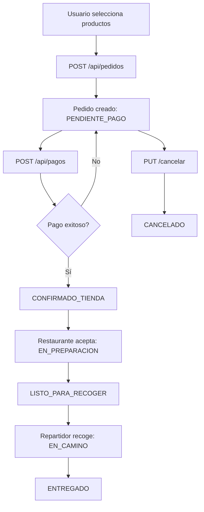

# 📖 API Documentation - Chaski Backend

## 🌐 Base URL

- **Desarrollo Local**: `http://localhost:8080/api`
- **Producción (Azure)**: `https://chaski-backend.azurewebsites.net/api`

## 📝 Resumen del Proyecto

Chaski Backend es una API REST completa para una aplicación de delivery de comida, desarrollada con Spring Boot 4.0.0 y Java 21. Incluye gestión de usuarios, restaurantes, productos, pedidos y pagos con integración de Stripe.

### Características Principales

- ✅ Autenticación con BCrypt
- ✅ Sistema de pedidos con seguimiento de estados
- ✅ Productos con opciones personalizables
- ✅ Integración de pagos con Stripe
- ✅ Cálculo automático de costos (subtotal, impuestos, envío)
- ✅ Gestión de múltiples direcciones por usuario
- ✅ Filtros avanzados para restaurantes
- ✅ CORS configurado para aplicaciones móviles
- ✅ Manejo global de excepciones
- ✅ Desplegado en Azure App Service

## 🔐 Autenticación

Esta API utiliza autenticación basada en BCrypt para el hash de contraseñas. No implementa JWT, por lo que cada request debe incluir las credenciales o el ID del usuario autenticado.

### Formato de Respuesta Estándar

**Éxito:**
```json
{
  "id": 1,
  "nombre": "Juan Pérez",
  "email": "juan@example.com",
  ...
}
```

**Error:**
```json
{
  "timestamp": "2024-12-14T15:30:00",
  "message": "Error descriptivo",
  "details": "Detalles adicionales del error"
}
```

## 🏗️ Arquitectura del Sistema

```
┌─────────────────┐
│  Android App    │
└────────┬────────┘
         │ HTTP/JSON
         ▼
┌─────────────────────────────────────────┐
│         Spring Boot REST API             │
│  ┌─────────────────────────────────┐   │
│  │       Controllers               │   │
│  │  (REST Endpoints + CORS)        │   │
│  └──────────────┬──────────────────┘   │
│                 │                        │
│  ┌──────────────▼──────────────────┐   │
│  │         Services                │   │
│  │  (Business Logic + BCrypt)      │   │
│  └──────────────┬──────────────────┘   │
│                 │                        │
│  ┌──────────────▼──────────────────┐   │
│  │       Repositories              │   │
│  │     (Spring Data JPA)           │   │
│  └──────────────┬──────────────────┘   │
│                 │                        │
│  ┌──────────────▼──────────────────┐   │
│  │       Mappers (MapStruct)       │   │
│  │      Entities ↔ DTOs            │   │
│  └─────────────────────────────────┘   │
└─────────────────────────────────────────┘
         │                    │
         ▼                    ▼
┌─────────────────┐  ┌─────────────────┐
│  MySQL Database │  │   Stripe API    │
└─────────────────┘  └─────────────────┘
```

## Modelo de Datos

### Entidades Principales

1. **Usuario** - Información de clientes
2. **Direccion** - Direcciones de entrega
3. **Restaurante** - Datos de restaurantes
4. **Categoria** - Categorías de restaurantes
5. **Producto** - Menú de productos
6. **GrupoOpciones** - Grupos de personalización
7. **Opcion** - Opciones individuales
8. **Pedido** - Órdenes realizadas
9. **DetallePedido** - Items del pedido
10. **OpcionDetallePedido** - Opciones seleccionadas
11. **Pago** - Información de pagos

### Relaciones

```
Usuario 1──N Direccion
Usuario 1──N Pedido

Restaurante N──N Categoria
Restaurante 1──N Producto
Restaurante 1──N Pedido

Producto 1──N GrupoOpciones
GrupoOpciones 1──N Opcion

Pedido 1──N DetallePedido
Pedido 1──1 Pago

DetallePedido N──1 Producto
DetallePedido 1──N OpcionDetallePedido
OpcionDetallePedido N──1 Opcion
```

## API Endpoints

### 1. 🔐 Autenticación y Usuarios

#### Tabla de Endpoints

| Método | Endpoint | Descripción | Autenticación |
|--------|----------|-------------|---------------|
| POST | `/api/usuarios/registro` | Registrar nuevo usuario | No requerida |
| POST | `/api/usuarios/login` | Iniciar sesión | No requerida |
| GET | `/api/usuarios/{id}` | Obtener perfil de usuario | Requerida |
| PUT | `/api/usuarios/{id}` | Actualizar perfil de usuario | Requerida |

---

#### 📝 **POST** `/api/usuarios/registro` - Registrar Usuario

Crea una nueva cuenta de usuario en el sistema. La contraseña se almacena de forma segura usando BCrypt.

**Headers:**
```
Content-Type: application/json
```

**Body (JSON):**
```json
{
  "nombre": "Juan Pérez",           // REQUERIDO - Nombre completo del usuario
  "email": "juan@example.com",      // REQUERIDO - Email único, usado para login
  "password": "MiPassword123",      // REQUERIDO - Mínimo 6 caracteres (se hashea con BCrypt)
  "telefono": "987654321",          // REQUERIDO - Número de teléfono
  "imagenPerfilUrl": "https://..."  // OPCIONAL - URL de la imagen de perfil del usuario
}
```

**Validaciones:**
- ✅ `email` debe ser único en el sistema
- ✅ `password` se hashea automáticamente con BCrypt antes de guardar
- ✅ `telefono` debe ser válido
- ✅ `imagenPerfilUrl` es completamente opcional (puede omitirse o enviarse como `null`)

**Respuesta Exitosa (201 Created):**
```json
{
  "id": 1,
  "nombre": "Juan Pérez",
  "email": "juan@example.com",
  "telefono": "987654321",
  "imagenPerfilUrl": "https://example.com/perfil.jpg",  // null si no se envió
  "fechaRegistro": "2025-12-14T10:30:00",
  "activo": true
}
```

**Respuestas de Error:**

| Código | Descripción | Ejemplo |
|--------|-------------|---------|
| 400 Bad Request | Email ya registrado | `{ "message": "El email ya está registrado" }` |
| 400 Bad Request | Datos inválidos | `{ "message": "El campo 'nombre' es requerido" }` |

**Ejemplo de Uso (cURL):**
```bash
# Sin imagen de perfil
curl -X POST http://localhost:8080/api/usuarios/registro \
  -H "Content-Type: application/json" \
  -d '{
    "nombre": "María García",
    "email": "maria@example.com",
    "password": "SecurePass456",
    "telefono": "912345678"
  }'

# Con imagen de perfil
curl -X POST http://localhost:8080/api/usuarios/registro \
  -H "Content-Type: application/json" \
  -d '{
    "nombre": "María García",
    "email": "maria@example.com",
    "password": "SecurePass456",
    "telefono": "912345678",
    "imagenPerfilUrl": "https://ejemplo.com/maria.jpg"
  }'
```

**Notas Importantes:**
- 📸 La imagen de perfil debe estar alojada en un servicio externo (ej: Cloudinary, AWS S3, Firebase Storage)
- 🔒 La contraseña nunca se devuelve en las respuestas por seguridad
- ✅ El usuario se crea con `activo: true` por defecto
- 📧 El email se usa como identificador único para el login

---

#### 🔓 **POST** `/api/usuarios/login` - Iniciar Sesión

Autentica a un usuario verificando sus credenciales (email y contraseña). Si las credenciales son correctas, retorna los datos del usuario.

**Headers:**
```
Content-Type: application/json
```

**Body (JSON):**
```json
{
  "email": "juan@example.com",     // REQUERIDO - Email registrado
  "password": "MiPassword123"      // REQUERIDO - Contraseña en texto plano
}
```

**Validaciones:**
- ✅ El email debe existir en la base de datos
- ✅ La contraseña se valida contra el hash almacenado (BCrypt)
- ✅ El usuario debe estar activo (`activo: true`)

**Respuesta Exitosa (200 OK):**
```json
{
  "id": 1,
  "nombre": "Juan Pérez",
  "email": "juan@example.com",
  "telefono": "987654321",
  "imagenPerfilUrl": "https://example.com/perfil.jpg",
  "fechaRegistro": "2025-12-14T10:30:00",
  "activo": true
}
```

**Respuestas de Error:**

| Código | Descripción | Ejemplo |
|--------|-------------|---------|
| 400 Bad Request | Credenciales incorrectas | `{ "message": "Credenciales inválidas" }` |
| 400 Bad Request | Usuario inactivo | `{ "message": "Usuario inactivo" }` |
| 400 Bad Request | Campos faltantes | `{ "message": "Email y password son requeridos" }` |

**Ejemplo de Uso (cURL):**
```bash
curl -X POST http://localhost:8080/api/usuarios/login \
  -H "Content-Type: application/json" \
  -d '{
    "email": "juan@example.com",
    "password": "MiPassword123"
  }'
```

**Flujo de Autenticación:**
```
1. Usuario envía email + password
2. Backend busca usuario por email
3. Backend valida password con BCrypt.matches()
4. Si es válido → retorna datos del usuario
5. Si es inválido → retorna error 400
```

**Notas de Seguridad:**
- 🔒 Las contraseñas se almacenan hasheadas con BCrypt (nunca en texto plano)
- 🔒 La contraseña nunca se incluye en la respuesta
- ⚠️ Ambos errores (email no existe / password incorrecta) retornan el mismo mensaje para seguridad
- ✅ Se valida que el usuario esté activo antes de permitir el login

**Uso en Android:**
```kotlin
// Guardar el ID del usuario después del login exitoso
val usuarioId = response.id
SharedPreferences.edit()
    .putLong("usuario_id", usuarioId)
    .putString("usuario_nombre", response.nombre)
    .putString("usuario_email", response.email)
    .apply()

// Usar el ID en requests subsecuentes
// Ej: GET /api/pedidos/usuario/{usuarioId}
```

---

#### 👤 **GET** `/api/usuarios/{id}` - Obtener Perfil de Usuario

Obtiene la información completa de un usuario por su ID.

**Headers:**
```
Content-Type: application/json
```

**Path Parameters:**
- `id` (Long) - ID del usuario

**Respuesta Exitosa (200 OK):**
```json
{
  "id": 1,
  "nombre": "Juan Pérez",
  "email": "juan@example.com",
  "telefono": "987654321",
  "imagenPerfilUrl": "https://example.com/perfil.jpg",
  "fechaRegistro": "2025-12-14T10:30:00",
  "activo": true
}
```

**Respuestas de Error:**

| Código | Descripción |
|--------|-------------|
| 404 Not Found | Usuario no encontrado |

**Ejemplo de Uso:**
```bash
curl -X GET http://localhost:8080/api/usuarios/1
```

---

#### ✏️ **PUT** `/api/usuarios/{id}` - Actualizar Perfil

Actualiza la información del perfil de un usuario. Solo se actualizan los campos enviados.

**Headers:**
```
Content-Type: application/json
```

**Path Parameters:**
- `id` (Long) - ID del usuario a actualizar

**Body (JSON) - Todos los campos son opcionales:**
```json
{
  "nombre": "Juan Carlos Pérez",           // OPCIONAL - Nuevo nombre
  "telefono": "998877665",                 // OPCIONAL - Nuevo teléfono
  "imagenPerfilUrl": "https://nueva.jpg"   // OPCIONAL - Nueva imagen de perfil
}
```

**Campos que NO se pueden actualizar:**
- ❌ `email` - Es el identificador único, no se puede cambiar
- ❌ `password` - Requiere endpoint separado (si se implementa)
- ❌ `fechaRegistro` - Se establece al crear la cuenta
- ❌ `activo` - Solo administradores (si se implementa)

**Respuesta Exitosa (200 OK):**
```json
{
  "id": 1,
  "nombre": "Juan Carlos Pérez",
  "email": "juan@example.com",
  "telefono": "998877665",
  "imagenPerfilUrl": "https://nueva.jpg",
  "fechaRegistro": "2025-12-14T10:30:00",
  "activo": true
}
```

**Ejemplo de Uso:**
```bash
# Actualizar solo el nombre
curl -X PUT http://localhost:8080/api/usuarios/1 \
  -H "Content-Type: application/json" \
  -d '{ "nombre": "Juan Carlos Pérez" }'

# Actualizar imagen de perfil
curl -X PUT http://localhost:8080/api/usuarios/1 \
  -H "Content-Type: application/json" \
  -d '{ "imagenPerfilUrl": "https://cloudinary.com/nueva-foto.jpg" }'

# Actualizar múltiples campos
curl -X PUT http://localhost:8080/api/usuarios/1 \
  -H "Content-Type: application/json" \
  -d '{
    "nombre": "Juan Carlos Pérez",
    "telefono": "998877665",
    "imagenPerfilUrl": "https://nueva.jpg"
  }'
```

---

### 2. 📍 Direcciones

| Método | Endpoint | Descripción |
|--------|----------|-------------|
| POST | `/api/direcciones` | Crear dirección |
| GET | `/api/direcciones/usuario/{usuarioId}` | Listar direcciones de usuario |
| GET | `/api/direcciones/{id}` | Obtener dirección por ID |
| PUT | `/api/direcciones/{id}` | Actualizar dirección |
| DELETE | `/api/direcciones/{id}` | Eliminar dirección |

### 3. 🍽️ Restaurantes

#### Tabla de Endpoints

| Método | Endpoint | Descripción | Autenticación |
|--------|----------|-------------|---------------|
| POST | `/api/restaurantes` | Crear nuevo restaurante | Requerida |
| GET | `/api/restaurantes` | Listar todos los restaurantes | No requerida |
| GET | `/api/restaurantes/{id}` | Obtener restaurante por ID | No requerida |
| GET | `/api/restaurantes/buscar?nombre={nombre}` | Buscar por nombre | No requerida |
| GET | `/api/restaurantes/filtrar/disponibilidad?estaAbierto={bool}` | Filtrar por apertura | No requerida |
| GET | `/api/restaurantes/filtrar/categoria/{categoriaId}` | Filtrar por categoría | No requerida |

---

#### 🏪 **POST** `/api/restaurantes` - Crear Restaurante

Crea un nuevo restaurante en el sistema con toda su información básica.

**Headers:**
```
Content-Type: application/json
```

**Body (JSON):**
```json
{
  "nombre": "Burger King",                              // REQUERIDO - Nombre del restaurante
  "descripcion": "Las mejores hamburguesas a la parrilla", // REQUERIDO - Descripción del restaurante
  "imagenLogoUrl": "https://example.com/logo.jpg",     // REQUERIDO - URL del logo
  "imagenPortadaUrl": "https://example.com/banner.jpg", // REQUERIDO - URL de la imagen de portada
  "direccion": "Av. Javier Prado 123, San Isidro",     // REQUERIDO - Dirección física
  "calificacionPromedio": 4.5,                          // OPCIONAL - Calificación inicial (0.0-5.0)
  "estaAbierto": true,                                  // REQUERIDO - Estado de apertura
  "tiempoEsperaMinutos": 30,                           // REQUERIDO - Tiempo estimado de preparación
  "costoEnvioBase": 5.00,                              // REQUERIDO - Costo base de envío
  "categorias": [                                       // OPCIONAL - Categorías del restaurante
    {
      "id": 1,
      "nombre": "Hamburguesas"
    },
    {
      "id": 3,
      "nombre": "Comida Rápida"
    }
  ]
}
```

**Validaciones:**
- ✅ `nombre` es requerido y debe ser único
- ✅ `direccion` debe ser una dirección válida
- ✅ `calificacionPromedio` debe estar entre 0.0 y 5.0
- ✅ `tiempoEsperaMinutos` debe ser mayor a 0
- ✅ `costoEnvioBase` debe ser mayor o igual a 0
- ✅ Las URLs de imágenes deben ser válidas

**Respuesta Exitosa (201 Created):**
```json
{
  "id": 10,
  "nombre": "Burger King",
  "descripcion": "Las mejores hamburguesas a la parrilla",
  "imagenLogoUrl": "https://example.com/logo.jpg",
  "imagenPortadaUrl": "https://example.com/banner.jpg",
  "direccion": "Av. Javier Prado 123, San Isidro",
  "calificacionPromedio": 4.5,
  "estaAbierto": true,
  "tiempoEsperaMinutos": 30,
  "costoEnvioBase": 5.00,
  "categorias": [
    {
      "id": 1,
      "nombre": "Hamburguesas"
    },
    {
      "id": 3,
      "nombre": "Comida Rápida"
    }
  ]
}
```

**Respuestas de Error:**

| Código | Descripción | Ejemplo |
|--------|-------------|---------|
| 400 Bad Request | Datos inválidos | `{ "message": "El campo 'nombre' es requerido" }` |
| 400 Bad Request | Nombre duplicado | `{ "message": "Ya existe un restaurante con ese nombre" }` |

**Ejemplo de Uso (cURL):**
```bash
curl -X POST http://localhost:8080/api/restaurantes \
  -H "Content-Type: application/json" \
  -d '{
    "nombre": "Burger King",
    "descripcion": "Las mejores hamburguesas a la parrilla",
    "imagenLogoUrl": "https://example.com/logo.jpg",
    "imagenPortadaUrl": "https://example.com/banner.jpg",
    "direccion": "Av. Javier Prado 123, San Isidro",
    "calificacionPromedio": 4.5,
    "estaAbierto": true,
    "tiempoEsperaMinutos": 30,
    "costoEnvioBase": 5.00,
    "categorias": [
      { "id": 1, "nombre": "Hamburguesas" },
      { "id": 3, "nombre": "Comida Rápida" }
    ]
  }'
```

**Notas Importantes:**
- 📸 Las imágenes deben estar alojadas en un servicio externo (ej: Cloudinary, AWS S3)
- 🏷️ Las categorías deben existir previamente en la base de datos
- ⭐ La calificación inicial es opcional, por defecto será 0.0
- 🕐 El `tiempoEsperaMinutos` es estimado y puede variar según demanda

---

#### 📋 **GET** `/api/restaurantes` - Listar Todos los Restaurantes

Obtiene la lista completa de todos los restaurantes registrados en el sistema.

**Headers:**
```
Content-Type: application/json
```

**Respuesta Exitosa (200 OK):**
```json
[
  {
    "id": 1,
    "nombre": "Burger King",
    "descripcion": "Las mejores hamburguesas",
    "imagenLogoUrl": "https://example.com/logo.jpg",
    "imagenPortadaUrl": "https://example.com/banner.jpg",
    "direccion": "Av. Javier Prado 123",
    "calificacionPromedio": 4.5,
    "estaAbierto": true,
    "tiempoEsperaMinutos": 30,
    "costoEnvioBase": 5.00,
    "categorias": [...]
  },
  {
    "id": 2,
    "nombre": "KFC",
    "descripcion": "Pollo frito estilo Kentucky",
    "imagenLogoUrl": "https://example.com/kfc-logo.jpg",
    "imagenPortadaUrl": "https://example.com/kfc-banner.jpg",
    "direccion": "Av. Larco 456, Miraflores",
    "calificacionPromedio": 4.3,
    "estaAbierto": false,
    "tiempoEsperaMinutos": 25,
    "costoEnvioBase": 4.50,
    "categorias": [...]
  }
]
```

**Ejemplo de Uso:**
```bash
curl -X GET http://localhost:8080/api/restaurantes
```

---

#### 🔍 **GET** `/api/restaurantes/{id}` - Obtener Restaurante por ID

Obtiene la información detallada de un restaurante específico.

**Path Parameters:**
- `id` (Long) - ID del restaurante

**Respuesta Exitosa (200 OK):**
```json
{
  "id": 1,
  "nombre": "Burger King",
  "descripcion": "Las mejores hamburguesas a la parrilla",
  "imagenLogoUrl": "https://example.com/logo.jpg",
  "imagenPortadaUrl": "https://example.com/banner.jpg",
  "direccion": "Av. Javier Prado 123, San Isidro",
  "calificacionPromedio": 4.5,
  "estaAbierto": true,
  "tiempoEsperaMinutos": 30,
  "costoEnvioBase": 5.00,
  "categorias": [
    {
      "id": 1,
      "nombre": "Hamburguesas"
    }
  ]
}
```

**Respuestas de Error:**

| Código | Descripción |
|--------|-------------|
| 404 Not Found | Restaurante no encontrado |

**Ejemplo de Uso:**
```bash
curl -X GET http://localhost:8080/api/restaurantes/1
```

---

#### 🔎 **GET** `/api/restaurantes/buscar?nombre={nombre}` - Buscar por Nombre

Busca restaurantes cuyo nombre contenga el texto especificado (búsqueda no sensible a mayúsculas).

**Query Parameters:**
- `nombre` (String) - Texto a buscar en el nombre del restaurante

**Ejemplo de Uso:**
```bash
# Buscar restaurantes que contengan "burger"
curl -X GET "http://localhost:8080/api/restaurantes/buscar?nombre=burger"
```

**Respuesta Exitosa (200 OK):**
```json
[
  {
    "id": 1,
    "nombre": "Burger King",
    "descripcion": "Las mejores hamburguesas",
    ...
  }
]
```

---

#### 🔓 **GET** `/api/restaurantes/filtrar/disponibilidad?estaAbierto={bool}` - Filtrar por Apertura

Filtra restaurantes según su estado de apertura.

**Query Parameters:**
- `estaAbierto` (Boolean) - `true` para abiertos, `false` para cerrados

**Ejemplo de Uso:**
```bash
# Obtener solo restaurantes abiertos
curl -X GET "http://localhost:8080/api/restaurantes/filtrar/disponibilidad?estaAbierto=true"
```

---

#### 🏷️ **GET** `/api/restaurantes/filtrar/categoria/{categoriaId}` - Filtrar por Categoría

Obtiene todos los restaurantes que pertenecen a una categoría específica.

**Path Parameters:**
- `categoriaId` (Long) - ID de la categoría

**Ejemplo de Uso:**
```bash
# Obtener todos los restaurantes de categoría "Hamburguesas" (id=1)
curl -X GET http://localhost:8080/api/restaurantes/filtrar/categoria/1
```

---

### 4. 🍔 Productos

#### Tabla de Endpoints

| Método | Endpoint | Descripción | Autenticación |
|--------|----------|-------------|---------------|
| POST | `/api/productos` | Crear nuevo producto | Requerida |
| GET | `/api/productos/restaurante/{restauranteId}` | Productos de un restaurante | No requerida |
| GET | `/api/productos/restaurante/{restauranteId}/disponibles` | Solo productos disponibles | No requerida |
| GET | `/api/productos/{id}` | Detalle del producto con opciones | No requerida |

---

#### 🍕 **POST** `/api/productos` - Crear Producto

Crea un nuevo producto asociado a un restaurante específico. Puede incluir grupos de opciones para personalización.

**Headers:**
```
Content-Type: application/json
```

**Body (JSON):**
```json
{
  "restauranteId": 1,                         // REQUERIDO - ID del restaurante al que pertenece
  "nombre": "Whopper",                        // REQUERIDO - Nombre del producto
  "descripcion": "Hamburguesa clásica con carne a la parrilla", // REQUERIDO - Descripción
  "precio": 15.90,                            // REQUERIDO - Precio base del producto
  "imagenUrl": "https://example.com/whopper.jpg", // REQUERIDO - URL de la imagen del producto
  "disponible": true,                         // REQUERIDO - Disponibilidad del producto
  "gruposOpciones": [                         // OPCIONAL - Grupos de opciones de personalización
    {
      "nombre": "Elige tu bebida",           // REQUERIDO - Nombre del grupo
      "esObligatorio": true,                 // REQUERIDO - Si es obligatorio seleccionar
      "seleccionMinima": 1,                  // REQUERIDO - Cantidad mínima a seleccionar
      "seleccionMaxima": 1,                  // REQUERIDO - Cantidad máxima a seleccionar
      "opciones": [                          // REQUERIDO - Lista de opciones disponibles
        {
          "nombre": "Coca Cola 500ml",       // REQUERIDO - Nombre de la opción
          "precioExtra": 0.00                // REQUERIDO - Precio adicional (0 si está incluido)
        },
        {
          "nombre": "Inca Kola 500ml",
          "precioExtra": 0.00
        },
        {
          "nombre": "Sprite 500ml",
          "precioExtra": 0.00
        }
      ]
    },
    {
      "nombre": "Extras",
      "esObligatorio": false,
      "seleccionMinima": 0,
      "seleccionMaxima": 5,
      "opciones": [
        {
          "nombre": "Queso extra",
          "precioExtra": 2.50
        },
        {
          "nombre": "Tocino",
          "precioExtra": 3.00
        },
        {
          "nombre": "Papas grandes",
          "precioExtra": 4.50
        }
      ]
    }
  ]
}
```

**Validaciones:**
- ✅ `restauranteId` debe existir en la base de datos
- ✅ `nombre` es requerido
- ✅ `precio` debe ser mayor a 0
- ✅ `imagenUrl` debe ser una URL válida
- ✅ En cada grupo de opciones: `seleccionMinima` ≤ `seleccionMaxima`
- ✅ Si `esObligatorio` es true, `seleccionMinima` debe ser al menos 1
- ✅ `precioExtra` puede ser 0 o positivo

**Respuesta Exitosa (201 Created):**
```json
{
  "id": 15,
  "restauranteId": 1,
  "nombre": "Whopper",
  "descripcion": "Hamburguesa clásica con carne a la parrilla",
  "precio": 15.90,
  "imagenUrl": "https://example.com/whopper.jpg",
  "disponible": true,
  "gruposOpciones": [
    {
      "id": 10,
      "nombre": "Elige tu bebida",
      "esObligatorio": true,
      "seleccionMinima": 1,
      "seleccionMaxima": 1,
      "opciones": [
        {
          "id": 25,
          "nombre": "Coca Cola 500ml",
          "precioExtra": 0.00
        },
        {
          "id": 26,
          "nombre": "Inca Kola 500ml",
          "precioExtra": 0.00
        },
        {
          "id": 27,
          "nombre": "Sprite 500ml",
          "precioExtra": 0.00
        }
      ]
    },
    {
      "id": 11,
      "nombre": "Extras",
      "esObligatorio": false,
      "seleccionMinima": 0,
      "seleccionMaxima": 5,
      "opciones": [
        {
          "id": 28,
          "nombre": "Queso extra",
          "precioExtra": 2.50
        },
        {
          "id": 29,
          "nombre": "Tocino",
          "precioExtra": 3.00
        },
        {
          "id": 30,
          "nombre": "Papas grandes",
          "precioExtra": 4.50
        }
      ]
    }
  ]
}
```

**Respuestas de Error:**

| Código | Descripción | Ejemplo |
|--------|-------------|---------|
| 400 Bad Request | Datos inválidos | `{ "message": "El campo 'nombre' es requerido" }` |
| 404 Not Found | Restaurante no encontrado | `{ "message": "Restaurante no encontrado" }` |
| 400 Bad Request | Precio inválido | `{ "message": "El precio debe ser mayor a 0" }` |

**Ejemplo de Uso (cURL):**
```bash
# Producto simple sin opciones
curl -X POST http://localhost:8080/api/productos \
  -H "Content-Type: application/json" \
  -d '{
    "restauranteId": 1,
    "nombre": "Pizza Margarita",
    "descripcion": "Pizza clásica con tomate y mozzarella",
    "precio": 25.00,
    "imagenUrl": "https://example.com/pizza.jpg",
    "disponible": true
  }'

# Producto con opciones de personalización
curl -X POST http://localhost:8080/api/productos \
  -H "Content-Type: application/json" \
  -d '{
    "restauranteId": 1,
    "nombre": "Whopper",
    "descripcion": "Hamburguesa clásica",
    "precio": 15.90,
    "imagenUrl": "https://example.com/whopper.jpg",
    "disponible": true,
    "gruposOpciones": [
      {
        "nombre": "Elige tu bebida",
        "esObligatorio": true,
        "seleccionMinima": 1,
        "seleccionMaxima": 1,
        "opciones": [
          { "nombre": "Coca Cola", "precioExtra": 0.00 },
          { "nombre": "Inca Kola", "precioExtra": 0.00 }
        ]
      }
    ]
  }'
```

**Notas Importantes:**
- 📸 Las imágenes deben estar alojadas en un servicio externo (Cloudinary, AWS S3, Firebase Storage)
- 🏷️ Los grupos de opciones son útiles para personalización (bebidas, tamaños, extras)
- 💰 El precio final del producto = `precio` + suma de `precioExtra` de opciones seleccionadas
- ✅ Si no hay opciones, simplemente omitir el campo `gruposOpciones` o enviarlo como array vacío `[]`

---

#### 📋 **GET** `/api/productos/restaurante/{restauranteId}` - Productos de un Restaurante

Obtiene todos los productos de un restaurante específico, incluyendo disponibles y no disponibles.

**Path Parameters:**
- `restauranteId` (Long) - ID del restaurante

**Respuesta Exitosa (200 OK):**
```json
[
  {
    "id": 1,
    "restauranteId": 1,
    "nombre": "Whopper",
    "descripcion": "Hamburguesa clásica",
    "precio": 15.90,
    "imagenUrl": "https://example.com/whopper.jpg",
    "disponible": true,
    "gruposOpciones": [...]
  },
  {
    "id": 2,
    "restauranteId": 1,
    "nombre": "Big King",
    "descripcion": "Doble carne con queso",
    "precio": 18.50,
    "imagenUrl": "https://example.com/bigking.jpg",
    "disponible": false,
    "gruposOpciones": [...]
  }
]
```

**Ejemplo de Uso:**
```bash
curl -X GET http://localhost:8080/api/productos/restaurante/1
```

---

#### ✅ **GET** `/api/productos/restaurante/{restauranteId}/disponibles` - Solo Productos Disponibles

Obtiene únicamente los productos disponibles de un restaurante.

**Path Parameters:**
- `restauranteId` (Long) - ID del restaurante

**Respuesta Exitosa (200 OK):**
```json
[
  {
    "id": 1,
    "restauranteId": 1,
    "nombre": "Whopper",
    "descripcion": "Hamburguesa clásica",
    "precio": 15.90,
    "imagenUrl": "https://example.com/whopper.jpg",
    "disponible": true,
    "gruposOpciones": [...]
  }
]
```

**Ejemplo de Uso:**
```bash
curl -X GET http://localhost:8080/api/productos/restaurante/1/disponibles
```

**Uso en Android:**
```kotlin
// Usar este endpoint para mostrar el menú disponible en la app
GET /api/productos/restaurante/1/disponibles
```

---

#### 🔍 **GET** `/api/productos/{id}` - Detalle del Producto

Obtiene la información completa de un producto específico, incluyendo todos sus grupos de opciones.

**Path Parameters:**
- `id` (Long) - ID del producto

**Respuesta Exitosa (200 OK):**
```json
{
  "id": 1,
  "restauranteId": 1,
  "nombre": "Whopper",
  "descripcion": "Hamburguesa clásica con carne a la parrilla, lechuga, tomate, cebolla, pepinillos y salsa especial",
  "precio": 15.90,
  "imagenUrl": "https://example.com/whopper.jpg",
  "disponible": true,
  "gruposOpciones": [
    {
      "id": 1,
      "nombre": "Elige tu bebida",
      "esObligatorio": true,
      "seleccionMinima": 1,
      "seleccionMaxima": 1,
      "opciones": [
        {
          "id": 1,
          "nombre": "Coca Cola 500ml",
          "precioExtra": 0.00
        },
        {
          "id": 2,
          "nombre": "Inca Kola 500ml",
          "precioExtra": 0.00
        },
        {
          "id": 3,
          "nombre": "Sprite 500ml",
          "precioExtra": 0.00
        }
      ]
    },
    {
      "id": 2,
      "nombre": "Extras",
      "esObligatorio": false,
      "seleccionMinima": 0,
      "seleccionMaxima": 5,
      "opciones": [
        {
          "id": 4,
          "nombre": "Queso extra",
          "precioExtra": 2.50
        },
        {
          "id": 5,
          "nombre": "Tocino",
          "precioExtra": 3.00
        }
      ]
    }
  ]
}
```

**Respuestas de Error:**

| Código | Descripción |
|--------|-------------|
| 404 Not Found | Producto no encontrado |

**Ejemplo de Uso:**
```bash
curl -X GET http://localhost:8080/api/productos/1
```

**Uso en Android:**
```kotlin
// Usar este endpoint para mostrar pantalla de detalle del producto
// con todas las opciones de personalización antes de agregar al carrito
GET /api/productos/{id}
```

**Cálculo de Precio Final:**
```
Precio Total = (precio_base * cantidad) + suma(precioExtra de opciones seleccionadas * cantidad)

Ejemplo:
- Whopper: S/ 15.90
- Opciones: Queso extra (S/ 2.50) + Tocino (S/ 3.00)
- Cantidad: 2

Total = (15.90 * 2) + (2.50 + 3.00) * 2
Total = 31.80 + 11.00
Total = S/ 42.80
```

---

### 5. 📦 Pedidos
      "nombre": "Elige tu bebida",
      "esObligatorio": true,
      "seleccionMinima": 1,
      "seleccionMaxima": 1,
      "opciones": [
        {
          "id": 1,
          "nombre": "Coca Cola",
          "precioExtra": 0.00
        }
      ]
    }
  ]
}
```

### 5. 📦 Pedidos

El sistema de pedidos maneja todo el ciclo de vida de una orden, desde su creación hasta la entrega final. Incluye cálculo automático de costos, gestión de estados y personalización de productos.

#### Tabla de Endpoints

| Método | Endpoint | Descripción | Autenticación |
|--------|----------|-------------|---------------|
| POST | `/api/pedidos` | Crear nuevo pedido | Requerida |
| GET | `/api/pedidos/usuario/{usuarioId}` | Historial de pedidos del usuario | Requerida |
| GET | `/api/pedidos/{id}` | Obtener detalle completo de un pedido | Requerida |
| PUT | `/api/pedidos/{id}/estado?estado={estado}` | Actualizar estado del pedido | Requerida |
| PUT | `/api/pedidos/{id}/cancelar` | Cancelar pedido | Requerida |
| GET | `/api/pedidos/estado/{estado}` | Filtrar pedidos por estado | Requerida |

---

#### 🔄 Flujo Completo de un Pedido



---

#### 📊 Estados del Pedido

| Estado | Descripción | ¿Quién lo cambia? | Siguiente Estado Posible |
|--------|-------------|-------------------|-------------------------|
| `PENDIENTE_PAGO` | Pedido creado, esperando pago | Sistema (automático) | `CONFIRMADO_TIENDA` o `CANCELADO` |
| `CONFIRMADO_TIENDA` | Pago confirmado, esperando preparación | Sistema (al confirmar pago) | `EN_PREPARACION` o `CANCELADO` |
| `EN_PREPARACION` | Restaurante preparando el pedido | Restaurante | `LISTO_PARA_RECOGER` |
| `LISTO_PARA_RECOGER` | Pedido listo para que repartidor recoja | Restaurante | `EN_CAMINO` |
| `EN_CAMINO` | Repartidor en camino a dirección de entrega | Repartidor | `ENTREGADO` |
| `ENTREGADO` | Pedido entregado al cliente | Repartidor | ❌ Estado final |
| `CANCELADO` | Pedido cancelado por usuario o sistema | Usuario/Sistema | ❌ Estado final |

**Reglas de Transición:**
- ✅ Solo se puede cancelar en estados: `PENDIENTE_PAGO`, `CONFIRMADO_TIENDA`, `EN_PREPARACION`
- ❌ NO se puede cancelar en estados: `LISTO_PARA_RECOGER`, `EN_CAMINO`, `ENTREGADO`
- ✅ Los estados avanzan linealmente (no retroceden)

---

#### 📝 **POST** `/api/pedidos` - Crear Pedido

Crea un nuevo pedido con productos y opciones personalizadas. El sistema calcula automáticamente todos los costos.

**Headers:**
```
Content-Type: application/json
```

**Body (JSON):**
```json
{
  "usuarioId": 1,                    // REQUERIDO - ID del usuario que hace el pedido
  "restauranteId": 1,                // REQUERIDO - ID del restaurante
  "direccionEntregaId": 1,           // REQUERIDO - ID de la dirección de entrega
  "notasInstrucciones": "Sin cebolla, extra salsa", // OPCIONAL - Instrucciones especiales
  "detalles": [                      // REQUERIDO - Lista de productos
    {
      "productoId": 1,               // REQUERIDO - ID del producto
      "cantidad": 2,                 // REQUERIDO - Cantidad (mínimo 1)
      "opciones": [                  // OPCIONAL - Opciones de personalización
        { "opcionId": 1 },           // ID de la opción seleccionada
        { "opcionId": 5 }
      ]
    },
    {
      "productoId": 3,
      "cantidad": 1,
      "opciones": [
        { "opcionId": 10 }
      ]
    }
  ]
}
```

**Validaciones:**
- ✅ `usuarioId` debe existir en la base de datos
- ✅ `restauranteId` debe existir y estar abierto (`estaAbierto: true`)
- ✅ `direccionEntregaId` debe pertenecer al usuario
- ✅ Todos los `productoId` deben existir y estar disponibles
- ✅ Todas las `opcionId` deben existir
- ✅ `cantidad` debe ser mayor a 0

**Cálculos Automáticos:**

El sistema calcula automáticamente:

1. **Subtotal de Productos:**
   ```
   Producto 1: S/. 15.90 × 2 = S/. 31.80
   + Opción 1 (extra queso): S/. 2.00 × 2 = S/. 4.00
   + Opción 5 (bebida grande): S/. 1.50 × 2 = S/. 3.00
   
   Producto 3: S/. 8.90 × 1 = S/. 8.90
   + Opción 10 (salsa picante): S/. 0.00
   
   SUBTOTAL = S/. 47.70
   ```

2. **Costo de Envío:**
   ```
   Basado en restaurante.costoEnvioBase
   Ejemplo: S/. 5.00
   ```

3. **Impuestos (18% IGV):**
   ```
   (Subtotal + Costo Envío) × 0.18
   (47.70 + 5.00) × 0.18 = S/. 9.49
   ```

4. **Total Final:**
   ```
   Subtotal + Costo Envío + Impuestos
   47.70 + 5.00 + 9.49 = S/. 62.19
   ```

**Respuesta Exitosa (201 Created):**
```json
{
  "id": 1,
  "usuarioId": 1,
  "restauranteId": 1,
  "direccionEntregaId": 1,
  "subtotalProductos": 47.70,
  "costoEnvio": 5.00,
  "impuestos": 9.49,
  "totalFinal": 62.19,
  "estado": "PENDIENTE_PAGO",
  "notasInstrucciones": "Sin cebolla, extra salsa",
  "fechaCreacion": "2025-12-14T16:00:00",
  "fechaActualizacion": "2025-12-14T16:00:00",
  "detalles": [
    {
      "id": 1,
      "productoId": 1,
      "nombreProducto": "Whopper",
      "cantidad": 2,
      "precioUnitario": 15.90,
      "opciones": [
        {
          "id": 1,
          "opcionId": 1,
          "nombreOpcion": "Extra queso",
          "precioExtraCobrado": 2.00
        },
        {
          "id": 2,
          "opcionId": 5,
          "nombreOpcion": "Bebida grande",
          "precioExtraCobrado": 1.50
        }
      ]
    },
    {
      "id": 2,
      "productoId": 3,
      "nombreProducto": "Papas fritas",
      "cantidad": 1,
      "precioUnitario": 8.90,
      "opciones": [
        {
          "id": 3,
          "opcionId": 10,
          "nombreOpcion": "Salsa picante",
          "precioExtraCobrado": 0.00
        }
      ]
    }
  ]
}
```

**Respuestas de Error:**

| Código | Descripción | Ejemplo |
|--------|-------------|---------|
| 400 Bad Request | Usuario no encontrado | `{ "message": "Usuario no encontrado" }` |
| 400 Bad Request | Restaurante cerrado | `{ "message": "Restaurante no disponible" }` |
| 400 Bad Request | Dirección no pertenece al usuario | `{ "message": "Dirección inválida" }` |
| 400 Bad Request | Producto no disponible | `{ "message": "Producto no disponible" }` |

**Ejemplo de Uso (cURL):**
```bash
curl -X POST http://localhost:8080/api/pedidos \
  -H "Content-Type: application/json" \
  -d '{
    "usuarioId": 1,
    "restauranteId": 1,
    "direccionEntregaId": 1,
    "notasInstrucciones": "Sin cebolla",
    "detalles": [
      {
        "productoId": 1,
        "cantidad": 2,
        "opciones": [
          { "opcionId": 1 },
          { "opcionId": 5 }
        ]
      }
    ]
  }'
```

---

#### 📋 **GET** `/api/pedidos/usuario/{usuarioId}` - Historial de Pedidos

Obtiene todos los pedidos realizados por un usuario, ordenados del más reciente al más antiguo.

**Path Parameters:**
- `usuarioId` (Long) - ID del usuario

**Respuesta Exitosa (200 OK):**
```json
[
  {
    "id": 3,
    "restauranteId": 2,
    "nombreRestaurante": "KFC",
    "subtotalProductos": 35.00,
    "costoEnvio": 5.00,
    "impuestos": 7.20,
    "totalFinal": 47.20,
    "estado": "ENTREGADO",
    "fechaCreacion": "2025-12-14T15:00:00",
    "fechaActualizacion": "2025-12-14T16:30:00"
  },
  {
    "id": 2,
    "restauranteId": 1,
    "nombreRestaurante": "Burger King",
    "subtotalProductos": 28.50,
    "costoEnvio": 5.00,
    "impuestos": 6.03,
    "totalFinal": 39.53,
    "estado": "EN_CAMINO",
    "fechaCreacion": "2025-12-14T14:00:00",
    "fechaActualizacion": "2025-12-14T15:45:00"
  },
  {
    "id": 1,
    "restauranteId": 1,
    "nombreRestaurante": "Burger King",
    "subtotalProductos": 47.70,
    "costoEnvio": 5.00,
    "impuestos": 9.49,
    "totalFinal": 62.19,
    "estado": "CANCELADO",
    "fechaCreacion": "2025-12-14T13:00:00",
    "fechaActualizacion": "2025-12-14T13:15:00"
  }
]
```

**Filtrado por Estado (Opcional):**
```
GET /api/pedidos/usuario/1?estado=ENTREGADO
```

---

#### 🔍 **GET** `/api/pedidos/{id}` - Detalle Completo del Pedido

Obtiene toda la información detallada de un pedido, incluyendo productos, opciones y costos.

**Path Parameters:**
- `id` (Long) - ID del pedido

**Respuesta Exitosa (200 OK):**
```json
{
  "id": 1,
  "usuarioId": 1,
  "nombreUsuario": "Juan Pérez",
  "restauranteId": 1,
  "nombreRestaurante": "Burger King",
  "direccionEntregaId": 1,
  "direccionCompleta": "Av. Los Héroes 123, San Isidro",
  "subtotalProductos": 47.70,
  "costoEnvio": 5.00,
  "impuestos": 9.49,
  "totalFinal": 62.19,
  "estado": "CONFIRMADO_TIENDA",
  "notasInstrucciones": "Sin cebolla, extra salsa",
  "fechaCreacion": "2025-12-14T16:00:00",
  "fechaActualizacion": "2025-12-14T16:05:00",
  "detalles": [
    {
      "id": 1,
      "productoId": 1,
      "nombreProducto": "Whopper",
      "cantidad": 2,
      "precioUnitario": 15.90,
      "subtotalItem": 38.80,
      "opciones": [
        {
          "id": 1,
          "opcionId": 1,
          "nombreOpcion": "Extra queso",
          "precioExtraCobrado": 2.00
        },
        {
          "id": 2,
          "opcionId": 5,
          "nombreOpcion": "Bebida grande",
          "precioExtraCobrado": 1.50
        }
      ]
    },
    {
      "id": 2,
      "productoId": 3,
      "nombreProducto": "Papas fritas",
      "cantidad": 1,
      "precioUnitario": 8.90,
      "subtotalItem": 8.90,
      "opciones": [
        {
          "id": 3,
          "opcionId": 10,
          "nombreOpcion": "Salsa picante",
          "precioExtraCobrado": 0.00
        }
      ]
    }
  ]
}
```

**Cálculo del subtotalItem:**
```
Whopper:
- Precio base: S/. 15.90
- Extra queso: S/. 2.00
- Bebida grande: S/. 1.50
- Subtotal por unidad: S/. 19.40
- Cantidad: 2
- SUBTOTAL ITEM: S/. 38.80

Papas fritas:
- Precio base: S/. 8.90
- Salsa picante: S/. 0.00
- Cantidad: 1
- SUBTOTAL ITEM: S/. 8.90
```

---

#### ✏️ **PUT** `/api/pedidos/{id}/estado` - Actualizar Estado

Actualiza el estado de un pedido. Solo permite transiciones válidas según el flujo.

**Path Parameters:**
- `id` (Long) - ID del pedido

**Query Parameters:**
- `estado` (String) - Nuevo estado del pedido

**Estados Válidos:**
```
PENDIENTE_PAGO
CONFIRMADO_TIENDA
EN_PREPARACION
LISTO_PARA_RECOGER
EN_CAMINO
ENTREGADO
CANCELADO
```

**Ejemplos:**
```
PUT /api/pedidos/1/estado?estado=EN_PREPARACION
PUT /api/pedidos/1/estado?estado=LISTO_PARA_RECOGER
PUT /api/pedidos/1/estado?estado=EN_CAMINO
PUT /api/pedidos/1/estado?estado=ENTREGADO
```

**Respuesta Exitosa (200 OK):**
```json
{
  "id": 1,
  "estado": "EN_PREPARACION",
  "fechaActualizacion": "2025-12-14T16:10:00"
}
```

**Respuestas de Error:**

| Código | Descripción |
|--------|-------------|
| 400 Bad Request | Transición de estado inválida |
| 404 Not Found | Pedido no encontrado |

---

#### ❌ **PUT** `/api/pedidos/{id}/cancelar` - Cancelar Pedido

Cancela un pedido. Solo se puede cancelar en estados tempranos.

**Path Parameters:**
- `id` (Long) - ID del pedido a cancelar

**Estados en los que se puede cancelar:**
- ✅ `PENDIENTE_PAGO`
- ✅ `CONFIRMADO_TIENDA`
- ✅ `EN_PREPARACION`
- ❌ `LISTO_PARA_RECOGER` (ya no se puede cancelar)
- ❌ `EN_CAMINO` (ya no se puede cancelar)
- ❌ `ENTREGADO` (estado final)

**Respuesta Exitosa (200 OK):**
```json
{
  "id": 1,
  "estado": "CANCELADO",
  "fechaActualizacion": "2025-12-14T16:15:00",
  "message": "Pedido cancelado exitosamente"
}
```

**Respuestas de Error:**

| Código | Descripción | Ejemplo |
|--------|-------------|---------|
| 400 Bad Request | No se puede cancelar en este estado | `{ "message": "No se puede cancelar un pedido en estado EN_CAMINO" }` |
| 404 Not Found | Pedido no encontrado | `{ "message": "Pedido no encontrado" }` |

---

#### 🔍 **GET** `/api/pedidos/estado/{estado}` - Filtrar por Estado

Obtiene todos los pedidos con un estado específico.

**Path Parameters:**
- `estado` (String) - Estado a filtrar

**Ejemplo:**
```
GET /api/pedidos/estado/EN_PREPARACION
GET /api/pedidos/estado/EN_CAMINO
GET /api/pedidos/estado/ENTREGADO
```

**Respuesta Exitosa (200 OK):**
```json
[
  {
    "id": 5,
    "usuarioId": 2,
    "restauranteId": 3,
    "totalFinal": 55.00,
    "estado": "EN_PREPARACION",
    "fechaCreacion": "2025-12-14T16:20:00"
  },
  {
    "id": 7,
    "usuarioId": 4,
    "restauranteId": 1,
    "totalFinal": 42.50,
    "estado": "EN_PREPARACION",
    "fechaCreacion": "2025-12-14T16:25:00"
  }
]
```

---

#### 🔄 Flujo Completo de Ejemplo

**Escenario:** Usuario hace un pedido, paga y recibe su comida.

```bash
# 1. Usuario crea el pedido
POST /api/pedidos
{
  "usuarioId": 1,
  "restauranteId": 1,
  "direccionEntregaId": 1,
  "detalles": [
    {
      "productoId": 1,
      "cantidad": 2,
      "opciones": [{ "opcionId": 1 }]
    }
  ]
}
# Response: { "id": 1, "estado": "PENDIENTE_PAGO", "totalFinal": 50.00 }

# 2. Usuario realiza el pago
POST /api/pagos
{
  "pedidoId": 1,
  "monto": 50.00,
  "metodo": "TARJETA_CREDITO"
}
# Response: { "id": 1, "estado": "PENDIENTE" }

# 3. Usuario confirma el pago (si payment.auto.approve=false)
POST /api/pagos/1/confirmar
# Response: { "id": 1, "estado": "COMPLETADO" }
# El pedido cambia automáticamente a: "CONFIRMADO_TIENDA"

# 4. Restaurante acepta y empieza a preparar
PUT /api/pedidos/1/estado?estado=EN_PREPARACION
# Response: { "id": 1, "estado": "EN_PREPARACION" }

# 5. Comida lista para recoger
PUT /api/pedidos/1/estado?estado=LISTO_PARA_RECOGER
# Response: { "id": 1, "estado": "LISTO_PARA_RECOGER" }

# 6. Repartidor recoge y sale a entregar
PUT /api/pedidos/1/estado?estado=EN_CAMINO
# Response: { "id": 1, "estado": "EN_CAMINO" }

# 7. Pedido entregado
PUT /api/pedidos/1/estado?estado=ENTREGADO
# Response: { "id": 1, "estado": "ENTREGADO" }

# 8. Usuario verifica su pedido
GET /api/pedidos/1
# Response: { "id": 1, "estado": "ENTREGADO", "totalFinal": 50.00 }
```

---

#### 💡 Notas Importantes

**Sobre Opciones de Productos:**
- Las opciones son configuradas por producto en `GrupoOpciones`
- Cada grupo puede tener `seleccionMinima` y `seleccionMaxima`
- El precio extra de cada opción se suma al precio del producto
- Las opciones se almacenan en `OpcionDetallePedido` con el precio al momento del pedido

**Sobre Cálculos:**
- Los cálculos se hacen al momento de crear el pedido
- Los precios se congelan (no cambian si el producto cambia de precio después)
- El costo de envío viene de `restaurante.costoEnvioBase`
- Los impuestos se calculan como 18% del (subtotal + envío)

**Sobre Estados:**
- Los estados NO retroceden (solo avanzan o cancelan)
- `PENDIENTE_PAGO` es el estado inicial de todo pedido nuevo
- `CONFIRMADO_TIENDA` se asigna automáticamente al confirmar el pago
- Los demás estados los actualiza el restaurante/repartidor manualmente

**Sobre Cancelación:**
- Solo el usuario puede cancelar su propio pedido
- No se puede cancelar si el pedido ya está `EN_CAMINO` o `ENTREGADO`
- Al cancelar, NO se procesa reembolso automático (esto es manual)

---

### 6. 💳 Pagos Simulados


**⚠️ IMPORTANTE:** El sistema de pagos es completamente simulado y NO requiere integración con Stripe. Todos los pagos se procesan internamente de forma ficticia.

#### Tabla de Endpoints

| Método | Endpoint | Descripción | Autenticación |
|--------|----------|-------------|---------------|
| POST | `/api/pagos` | Crear pago simulado | Requerida |
| POST | `/api/pagos/{id}/confirmar` | Confirmar pago manualmente | Requerida |
| POST | `/api/pagos/{id}/marcar-fallido` | Marcar pago como fallido | Requerida |
| GET | `/api/pagos/pedido/{pedidoId}` | Obtener pago de un pedido | Requerida |
| GET | `/api/pagos/{id}` | Obtener pago por ID | Requerida |

---

#### 📝 **POST** `/api/pagos` - Crear Pago Simulado

Crea un pago simulado para un pedido. Genera automáticamente una referencia ficticia.

**Headers:**
```
Content-Type: application/json
```

**Body (JSON):**
```json
{
  "pedidoId": 1,           // REQUERIDO - ID del pedido a pagar
  "monto": 50.00,          // REQUERIDO - Monto total a pagar
  "metodo": "TARJETA_CREDITO"  // REQUERIDO - Ver métodos disponibles abajo
}
```

**Métodos de Pago Disponibles:**
- `TARJETA_CREDITO` - Tarjeta de crédito simulada
- `TARJETA_DEBITO` - Tarjeta de débito simulada
- `YAPE` - Pago con Yape simulado
- `EFECTIVO` - Pago en efectivo (contra entrega)

**Respuesta Exitosa (201 Created) - Confirmación Manual:**
```json
{
  "id": 1,
  "pedidoId": 1,
  "monto": 50.00,
  "metodo": "TARJETA_CREDITO",
  "estado": "PENDIENTE",
  "referenciaPasarela": "SIM-TC-1702564321-A3F9",
  "fechaPago": null
}
```

**Respuesta Exitosa (201 Created) - Auto-aprobación Activada:**
```json
{
  "id": 1,
  "pedidoId": 1,
  "monto": 50.00,
  "metodo": "TARJETA_CREDITO",
  "estado": "COMPLETADO",
  "referenciaPasarela": "SIM-TC-1702564321-A3F9",
  "fechaPago": "2025-12-14T15:30:45"
}
```

**Formato de Referencia:**
```
SIM-{PREFIJO}-{TIMESTAMP}-{CODIGO_ALEATORIO}
```

**Prefijos por método:**
- `TC` - Tarjeta de crédito
- `TD` - Tarjeta de débito
- `YAPE` - Yape
- `EFEC` - Efectivo

**Respuestas de Error:**

| Código | Descripción |
|--------|-------------|
| 400 Bad Request | El pedido ya tiene un pago asociado |
| 404 Not Found | Pedido no encontrado |

---

#### ✅ **POST** `/api/pagos/{id}/confirmar` - Confirmar Pago

Confirma un pago pendiente de forma manual. Actualiza el estado del pago a `COMPLETADO` y el estado del pedido a `CONFIRMADO_TIENDA`.

**Path Parameters:**
- `id` (Long) - ID del pago a confirmar

**Respuesta Exitosa (200 OK):**
```json
{
  "id": 1,
  "pedidoId": 1,
  "monto": 50.00,
  "metodo": "TARJETA_CREDITO",
  "estado": "COMPLETADO",
  "referenciaPasarela": "SIM-TC-1702564321-A3F9",
  "fechaPago": "2025-12-14T15:35:12"
}
```

**Respuestas de Error:**

| Código | Descripción |
|--------|-------------|
| 400 Bad Request | El pago ya fue completado |
| 404 Not Found | Pago no encontrado |

---

#### ❌ **POST** `/api/pagos/{id}/marcar-fallido` - Marcar como Fallido

Marca un pago como fallido, simulando el rechazo del pago.

**Path Parameters:**
- `id` (Long) - ID del pago a marcar como fallido

**Respuesta Exitosa (200 OK):**
```json
{
  "id": 1,
  "pedidoId": 1,
  "monto": 50.00,
  "metodo": "TARJETA_CREDITO",
  "estado": "FALLIDO",
  "referenciaPasarela": "SIM-TC-1702564321-A3F9",
  "fechaPago": null
}
```

---

#### 🔍 **GET** `/api/pagos/pedido/{pedidoId}` - Obtener Pago por Pedido

Obtiene el pago asociado a un pedido específico.

**Path Parameters:**
- `pedidoId` (Long) - ID del pedido

**Respuesta Exitosa (200 OK):**
```json
{
  "id": 1,
  "pedidoId": 1,
  "monto": 50.00,
  "metodo": "YAPE",
  "estado": "COMPLETADO",
  "referenciaPasarela": "SIM-YAPE-1702564325-C8D3",
  "fechaPago": "2025-12-14T15:30:45"
}
```

**Respuestas de Error:**

| Código | Descripción |
|--------|-------------|
| 404 Not Found | No se encontró pago para este pedido |

---

#### 🔍 **GET** `/api/pagos/{id}` - Obtener Pago por ID

Obtiene un pago específico por su ID.

**Path Parameters:**
- `id` (Long) - ID del pago

**Respuesta Exitosa (200 OK):**
```json
{
  "id": 1,
  "pedidoId": 1,
  "monto": 50.00,
  "metodo": "EFECTIVO",
  "estado": "PENDIENTE",
  "referenciaPasarela": "SIM-EFEC-1702564326-E9F1",
  "fechaPago": null
}
```

---

#### 📊 Estados de Pago

| Estado | Descripción | Es Final |
|--------|-------------|----------|
| `PENDIENTE` | Pago creado, esperando confirmación | ❌ |
| `COMPLETADO` | Pago confirmado exitosamente | ✅ |
| `FALLIDO` | Pago rechazado o fallido | ✅ |

---

#### ⚙️ Configuración de Auto-aprobación

El sistema soporta dos modos de operación:

**Modo Manual (por defecto):**
```properties
payment.auto.approve=false
```
- Los pagos se crean con estado `PENDIENTE`
- Requieren confirmación manual con `/confirmar`

**Modo Auto-aprobación:**
```properties
payment.auto.approve=true
```
- Los pagos se crean con estado `COMPLETADO`
- No requieren confirmación manual
- El pedido pasa automáticamente a `CONFIRMADO_TIENDA`

**Configurar en Railway/Azure:**
```bash
PAYMENT_AUTO_APPROVE=true
```

---

#### 📝 Ejemplo Completo de Flujo de Pago

```bash
# 1. Crear pedido
POST /api/pedidos
{
  "usuarioId": 1,
  "restauranteId": 1,
  "direccionEntregaId": 1,
  "detalles": [...]
}
# Response: { "id": 1, "totalFinal": 50.00 }

# 2. Crear pago para el pedido
POST /api/pagos
{
  "pedidoId": 1,
  "monto": 50.00,
  "metodo": "TARJETA_CREDITO"
}
# Response: { "id": 1, "estado": "PENDIENTE", "referenciaPasarela": "SIM-TC-..." }

# 3. Confirmar pago (solo si payment.auto.approve=false)
POST /api/pagos/1/confirmar
# Response: { "id": 1, "estado": "COMPLETADO", "fechaPago": "2025-12-14T15:35:12" }

# 4. Verificar estado del pedido
GET /api/pedidos/1
# Response: { "id": 1, "estado": "CONFIRMADO_TIENDA" }
```

---

**📖 Para más detalles, ver:** [`SISTEMA_PAGOS_SIMULADOS.md`](./SISTEMA_PAGOS_SIMULADOS.md)

---

## Códigos de Respuesta HTTP

| Código | Significado |
|--------|-------------|
| 200 | OK - Operación exitosa |
| 201 | Created - Recurso creado |
| 204 | No Content - Eliminación exitosa |
| 400 | Bad Request - Datos inválidos |
| 404 | Not Found - Recurso no encontrado |
| 500 | Internal Server Error - Error del servidor |

## Formato de Errores

```json
{
  "status": 400,
  "message": "El email ya está registrado",
  "timestamp": "2025-01-14T11:00:00"
}
```

**Errores de Validación:**
```json
{
  "status": 400,
  "errors": {
    "email": "Formato de email inválido",
    "password": "La contraseña es obligatoria"
  },
  "timestamp": "2025-01-14T11:00:00"
}
```

## Características de Seguridad

### Hashing de Contraseñas
- BCrypt con factor de trabajo de 10
- Salt generado automáticamente
- Contraseñas nunca almacenadas en texto plano

### CORS
- Configurado para permitir peticiones desde cualquier origen
- Métodos permitidos: GET, POST, PUT, DELETE, OPTIONS
- Headers permitidos: Todos

### Validaciones
- Bean Validation (JSR-380)
- Validaciones personalizadas en servicios
- Validación de transiciones de estado
- Verificación de disponibilidad de productos

## Integración con Stripe

### Flujo de Pago con Tarjeta

1. **Cliente crea pedido** → Estado: `PENDIENTE_PAGO`
2. **Cliente crea pago** → Stripe genera PaymentIntent
3. **App obtiene client secret** → Para procesar pago en cliente
4. **Cliente confirma pago** → Stripe procesa
5. **Webhook notifica resultado** → Backend actualiza estado
6. **Pago exitoso** → Pedido cambia a `CONFIRMADO_TIENDA`

### Configuración de Webhook

```bash
URL: https://tu-dominio.com/api/pagos/webhook/stripe
Eventos: payment_intent.succeeded, payment_intent.payment_failed
```

## Cálculo de Precios

```
Subtotal = Σ((Precio Producto + Σ Precio Opciones) × Cantidad)
Impuestos = Subtotal × 0.18 (18% IGV)
Total = Subtotal + Costo Envío + Impuestos
```

## Reglas de Negocio

### Pedidos
- Solo se pueden crear pedidos de restaurantes abiertos
- Los productos deben estar disponibles
- Las opciones obligatorias deben ser seleccionadas
- No se puede cancelar un pedido en estado `EN_CAMINO` o `ENTREGADO`

### Direcciones
- Solo puede haber una dirección predeterminada por usuario
- Al marcar una como predeterminada, las demás se desmarcan

### Usuarios
- Email único
- Teléfono único (si se proporciona)
- Contraseña hasheada automáticamente

## Performance y Optimización

- **Lazy Loading**: Relaciones cargadas bajo demanda
- **DTOs**: Transferencia optimizada de datos
- **Índices**: En campos de búsqueda frecuente
- **Connection Pooling**: HikariCP por defecto

## Tecnologías Utilizadas

| Tecnología | Versión | Propósito |
|------------|---------|-----------|
| Java | 21 | Lenguaje principal |
| Spring Boot | 3.4.1 | Framework |
| Spring Data JPA | 3.4.1 | Persistencia |
| MySQL | 8.0+ | Base de datos |
| MapStruct | 1.5.5 | Mapeo de objetos |
| Lombok | Latest | Reducción de boilerplate |
| BCrypt | Latest | Hashing de contraseñas |
| Stripe Java SDK | 24.8.0 | Procesamiento de pagos |
| Maven | 3.6+ | Gestión de dependencias |

## Buenas Prácticas Implementadas

✅ Separación de responsabilidades (Controller-Service-Repository)
✅ DTOs para transferencia de datos
✅ Mappers automáticos con MapStruct
✅ Validaciones con Bean Validation
✅ Manejo centralizado de excepciones
✅ CORS configurado
✅ Logging de SQL queries
✅ Timestamps automáticos
✅ Transacciones gestionadas
✅ Código limpio y documentado

## Limitaciones Actuales

⚠️ Sin autenticación JWT (autenticación simple)
⚠️ Sin paginación en listados
⚠️ Sin caché
⚠️ Sin rate limiting
⚠️ Sin audit logging
⚠️ Stripe en modo test

## Próximas Mejoras Sugeridas

🔜 Implementar JWT para autenticación stateless
🔜 Agregar paginación y sorting a los listados
🔜 Implementar Redis para caché
🔜 Agregar notificaciones push
🔜 Sistema de calificaciones y reseñas
🔜 Chat en tiempo real
🔜 Panel de administración
🔜 Reportes y analytics
🔜 Cupones y descuentos
🔜 Programa de lealtad

## Documentación Adicional

- `README.md` - Información general del proyecto
- `INSTALLATION.md` - Guía de instalación
- `TESTING_GUIDE.md` - Guía de pruebas
- `data.sql` - Datos de ejemplo

## Soporte

Para reportar bugs o sugerir mejoras, consulta la documentación del proyecto o contacta al equipo de desarrollo.

---

**Versión:** 1.0.0  
**Última actualización:** Enero 2025  
**Estado:** ✅ Producción Ready (con limitaciones señaladas)

